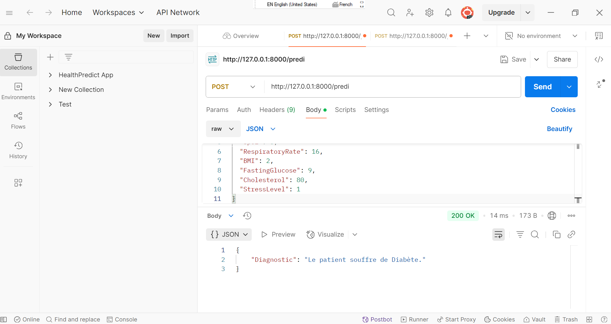

# 🩺 Prediction des Maladies et Proposition de Traitement

Ce projet propose une **API intelligente** construite avec **FastAPI** pour **prédire des maladies** à partir de données médicales de patients. L'application repose sur un **modèle de machine learning** (Logistic Regression) géré via **MLflow**, et peut facilement être déployée grâce à **Docker**.

## 🚀 Objectifs

- Prédire automatiquement une maladie probable à partir de données physiologiques.
- Fournir un diagnostic lisible pour les professionnels de santé.
- Faciliter le déploiement grâce à Docker et docker-compose.
- Préparer une base pour intégrer à terme des recommandations de traitement.


---

## 🧠 Modèle utilisé

- **Type** : Régression Logistique
- **Outil de gestion** : [MLflow](https://mlflow.org/)
- **Suivi de version** : Activé via un dossier local `mlruns/`

---

## 📊 Données d'entrée attendues

L'API reçoit les données suivantes au format JSON :

| Champ              | Type    | Description                          |
|--------------------|---------|--------------------------------------|
| `Temperature`       | float   | Température corporelle (°C)          |
| `Pulse`             | float   | Pouls (battements/minute)            |
| `BloodPressure`     | float   | Pression artérielle (mmHg)           |
| `SpO2`              | float   | Saturation en oxygène (%)            |
| `RespiratoryRate`   | float   | Fréquence respiratoire               |
| `BMI`               | float   | Indice de Masse Corporelle           |
| `FastingGlucose`    | float   | Glycémie à jeun (mg/dL)              |
| `Cholesterol`       | float   | Taux de cholestérol (mg/dL)          |
| `StressLevel`       | float   | Niveau de stress (échelle de 0 à 10) |

---

## ⚙️ Lancer le projet en local avec Docker

### 1. Prérequis

- [Docker](https://www.docker.com/) installé
- `mlruns/` contient le modèle MLflow entraîné
- Structure du projet :

```

Prediction\_des\_Maladies\_et\_Proposition\_de\_Traitement/
├── main.py
├── docker/
│   └── Dockerfile
├── docker-compose.yml
├── mlruns/
│   └── ... (fichiers du modèle)

````

### 2. Démarrer le projet

```bash
docker compose up --build
````

L'API sera accessible sur : [http://localhost:8000/docs](http://localhost:8000/docs)

---

## 🧪 Exemple de requête (via Postman ou curl)

### POST `/predi`

**Headers** :

```http
Content-Type: application/json
```

**Body JSON** :

```json
{
  "Temperature": 36.6,
  "Pulse": 72,
  "BloodPressure": 120,
  "SpO2": 98,
  "RespiratoryRate": 16,
  "BMI": 22.5,
  "FastingGlucose": 90,
  "Cholesterol": 180,
  "StressLevel": 3.5
}
```

**Réponse JSON** :

```json
{
  "Diagnostic": "Le patient souffre de l'Asthme."
}
```

---

## 📦 Fonctionnalités futures (roadmap)

* 🔬 Intégration de modèles Deep Learning.
* 🧾 Génération automatique de recommandations thérapeutiques.
* 📊 Dashboard de visualisation Streamlit.
* 🔐 Sécurisation de l’API (authentification, rate limiting).
* 🌍 Déploiement sur le cloud (Render, Azure, etc.).

---

## 👨‍💻 Auteur

**Abdias Arsène** – *IT Consultant in Innovative Technologies*
💼 Santé | Humanitaire | IA | NLP | Web Apps
🔗 LinkedIn : [Abdias Arsène.Z✅✅](https://www.linkedin.com/in/abdias-arsene)
📧 E-mail : abdiasarsene@gmail.com

---

## 📝 Licence

Ce projet est sous licence **MIT**.
Libre à vous de l'utiliser, le modifier ou le distribuer, en citant l’auteur original.
