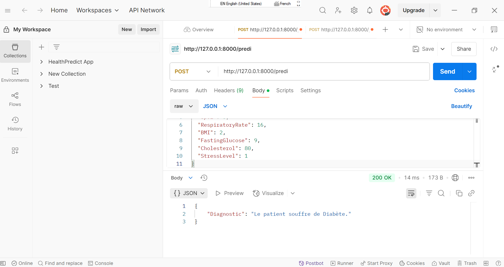

# 🩺 Prediction des Maladies et Proposition de Traitement

Ce projet propose une **API intelligente** construite avec **FastAPI** pour **prédire des maladies** à partir de données médicales de patients. L'application repose sur un **modèle de machine learning** (Logistic Regression) géré via **MLflow**, et peut facilement être déployée grâce à **Docker**.

## 🚀 Objectifs

- Prédire automatiquement une maladie probable à partir de données physiologiques.
- Fournir un diagnostic lisible pour les professionnels de santé.
- Faciliter le déploiement grâce à Docker et docker-compose.
- Préparer une base pour intégrer à terme des recommandations de traitement.


---

## 🧠 Modèle utilisé

- **Type** : Régression Logistique
- **Outil de gestion** : [MLflow](https://mlflow.org/)
- **Suivi de version** : Activé via un dossier local `mlruns/`

---

## ⚙️ Structure du projet

```

📁 Prediction\_des\_Maladies\_et\_Proposition\_de\_Traitement/
├── 📂 app/
|-- |-- __init__.py
|-- |-- database.py
|-- |-- main.py
|-- |-- model.py
|-- 📂 database/
|-- |-- patient_data.sql
├── 📂 docker/
│   └── Dockerfile
|-- 📂 notebooks/
|-- |-- __init__.py
|-- |-- features_selected.ipynb
|-- |-- eda.ipynb
|-- |-- models.ipynb
|-- |-- main.ipynb
|-- 📂 static/
|-- |-- numerous of images saved
├── docker-compose.yml
├── 📂 mlruns/
│   └── ... (fichiers du modèle)
├── __init__.py
├── .gitignore
├── docker-compose.yml
├── README.md
├── requirements.txt

````
---

## 📦 Fonctionnalités 

* 🔬 Intégration de modèles : Forêt Aléatoire, Regression Logistique, SVM, XGBoost.
* 🧾 Génération automatique de recommandations thérapeutiques.
* 📊 Containerisation avec Dokcer.
* 🔐 Sécurisation de l’API avec FastAPI (authentification, rate limiting).
* 🌍 Intégration Continue/Déploiement Continu/Réentraînement Annuel


---

## 👨‍💻 Auteur

**Abdias Arsène** – *IT Consultant in Innovative Technologies*
* 💼 Santé | Humanitaire | IA | NLP | Web Apps
* 🔗 LinkedIn : [Abdias Arsène.Z✅✅](https://www.linkedin.com/in/abdias-arsene)
* 📧 E-mail : abdiasarsene@gmail.com
