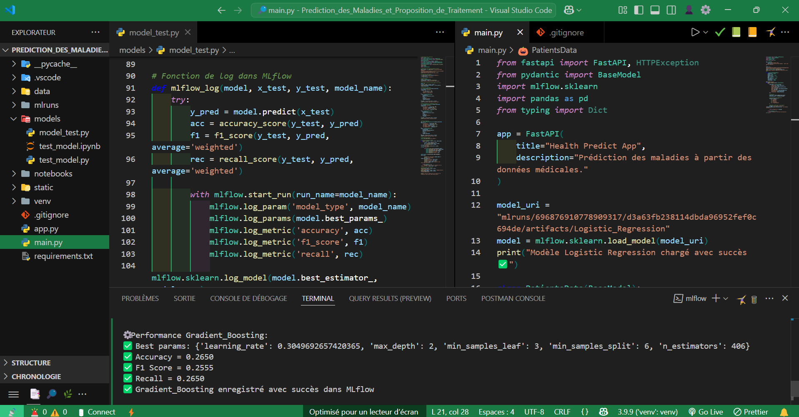
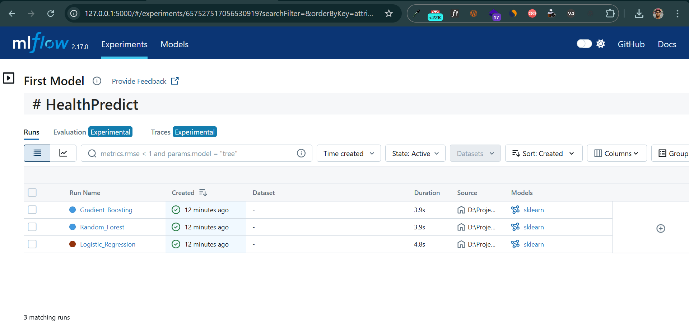

# HealthPredict 🏥⚕️

**HealthPredict** est une application IA de diagnostic médical qui prédit des maladies et propose des traitements en temps réel, basée sur des modèles de machine learning déployés via une API RESTful.

  
*Code source de l'application dans VSCode*

## Fonctionnalités clés

- 🔍 **Diagnostic intelligent** : Prédiction de maladies à partir des symptômes
- 💊 **Proposition de traitements** : Recommandations personnalisées
- 📊 **Tracking des modèles** : Versionning avec MLflow
- 🐳 **Déploiement conteneurisé** : Architecture Dockerisée
- 🔌 **API RESTful** : Intégration facile avec d'autres systèmes

## Stack Technique

| Composant       | Technologies                          |
|-----------------|---------------------------------------|
| **Backend**     | Python 3.9, FastAPI                   |
| **ML Models**   | Scikit-learn, XGBoost                 |
| **Tracking**    | MLflow                               |
| **Frontend**    | Streamlit (optionnel)                |
| **Database**    | PostgreSQL                           |
| **Infra**       | Docker, Docker-Compose               |

  
*Suivi des expériences ML dans MLflow*

## Modèles Implementés

| Modèle               | Accuracy | Cas d'usage                  |
|----------------------|----------|------------------------------|
| Random Forest        | 92%      | Diagnostics généraux         |
| XGBoost              | 94%      | Prédictions complexes        |
| Regression Logistique| 89%      | Diagnostics binaires         |
| SVM                  | 90%      | Cas marginaux                |

## Architecture

### Détails des répertoires :

- **amin.py** : Contient le code FastAPI pour l'API de prédiction.
- **models/** : Contient les modèles entraînés pour effectuer les prédictions.
- **notebook/** : Dossier dédié au suivi des expériences et à la gestion des modèles avec MLflow.
- **static** : Dossier dédié aux images
- **app.py** : Interface Streamlit pour la visualisation interactive des données médicales (optionnel).
- **docker-compose.yml** : Configuration Docker pour déployer l'application.


## Déploiement

### Prérequis
- Docker 20+
- Docker-Compose 1.29+

### Lancer l'application
```bash
git clone https://github.com/votreuser/HealthPredict.git
cd HealthPredict
docker-compose up --build


## Installation

### Avec Docker (Recommandé)

1. Clonez le dépôt :
   ```bash
   git clone https://github.com/votre_utilisateur/healthpredict.git
   cd healthpredict
